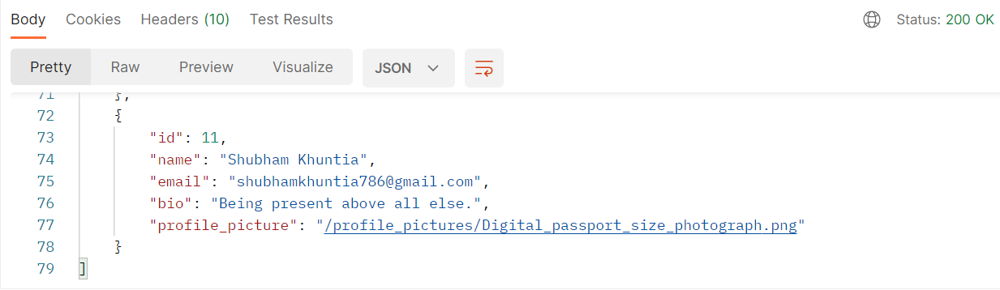
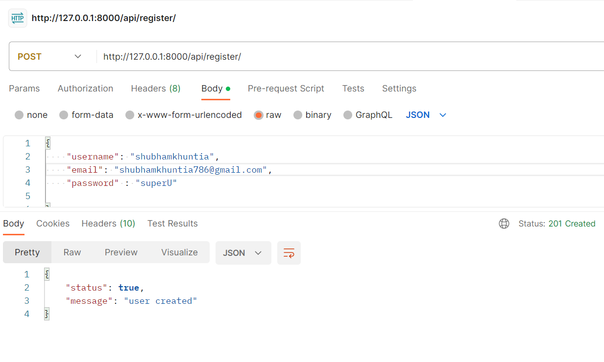
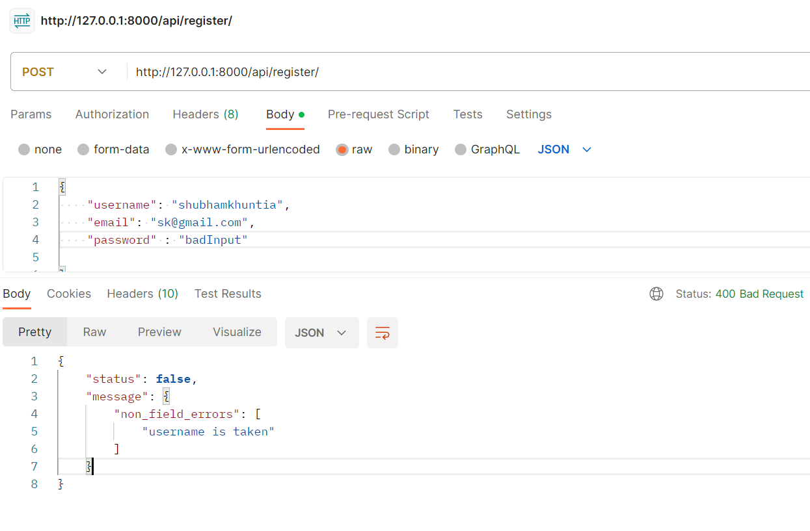
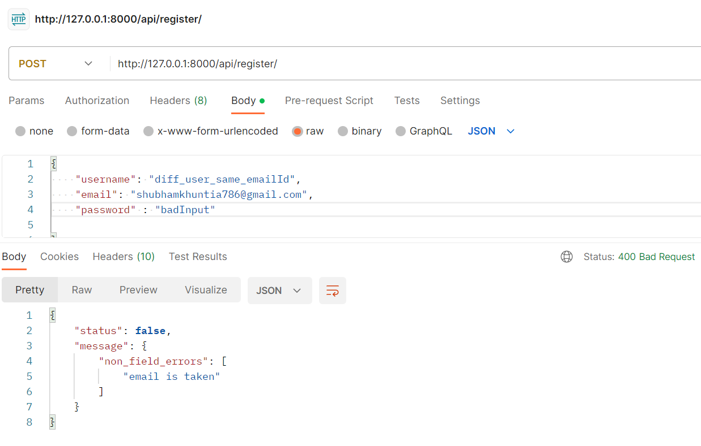
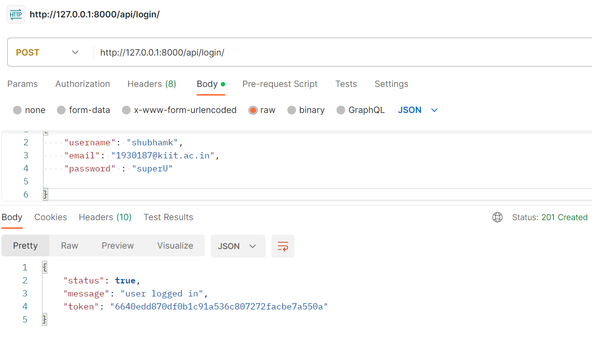
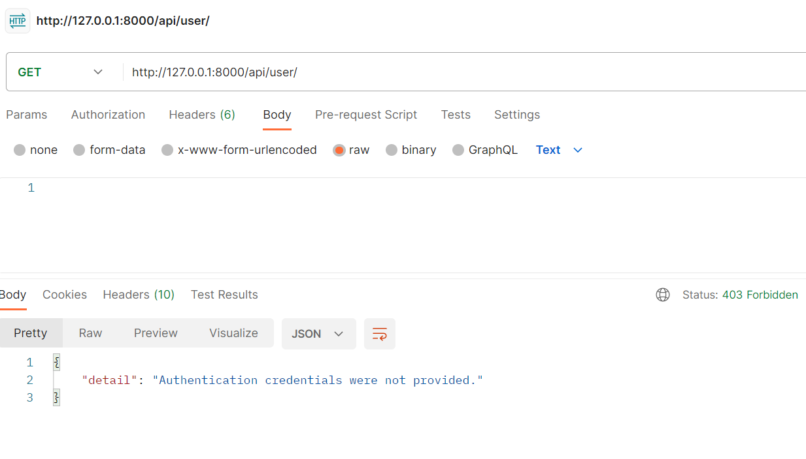
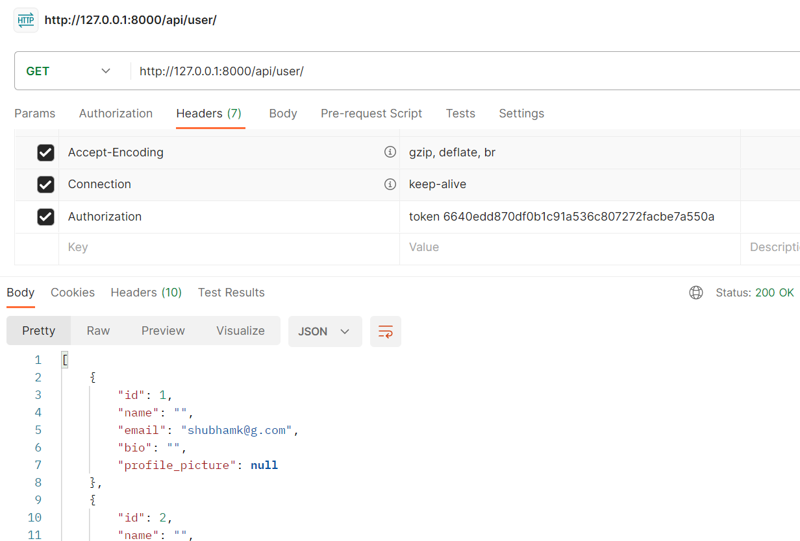
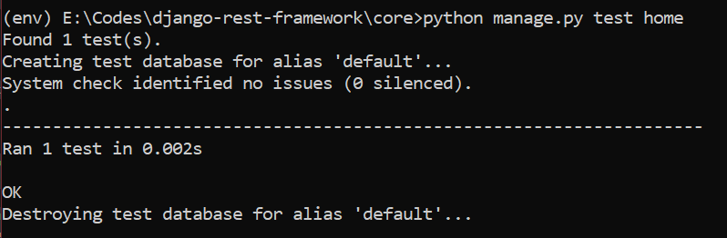

### Steps

- `virutalenv env`
- `cd env/scripts`
- `activate`
- change to core directory
- install DRF, pillow
- Make migrations & migrate
- `python manage.py runserver`

## URL Routes

Registering account
`http://127.0.0.1:8000/api/register/`

Loggin into account
`http://127.0.0.1:8000/api/login/`

Creating/Updating/Getting users (GET, POST, PATCH)
`http://127.0.0.1:8000/api/user/`

### When not logged in

### Authenticated using token

### Runiing unit test cases

